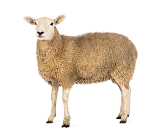

```{r setup, include=FALSE}
library(tidyverse)
library(lubridate)
library(knitr)
library(mgcv)
library(shiny)
library(gtools)
library(Manu)
library(colorspace)
theme_set(theme_minimal(base_size=13))
knitr::opts_chunk$set(echo = FALSE, message = FALSE, warning = FALSE,
                      fig.retina = 3, fig.align='center',
                      fig.dim=c(4.8,4.8), out.width='100%', dev.args=list(bg="transparent"))

#theme_update(theme(plot.background = element_rect(fill = "transparent", color = NA)))
opts_chunk$set(echo=FALSE, message=FALSE, warning=FALSE, fig.height = 5, fig.align='center', bg='transparent', dev.args=list(bg='transparent'))
attr_data <- read.csv("data/dirichlet_island/attribution_data.csv") %>%
  filter(Source != "Human" | Year >= 2008)
sts = attr_data %>%
  group_by(ST) %>% count(Source) %>% spread(Source, n, fill=0) %>%
  ungroup()
sts_ur = attr_data %>% filter(Source == "Human") %>%
  group_by(ST) %>% count(UR2006) %>% ungroup()
nz = read_csv("data/dirichlet_island/dhb_cases.csv") %>%
  mutate(Date = dmy(paste(1, Month, Year))) %>%
  filter(Year >= 2006) %>% group_by(Date) %>%
  summarise(Count = sum(Count, na.rm=TRUE), Population = sum(PopulationInterpolated, na.rm=TRUE)) %>%
  mutate(Rate = Count/Population*100000*12)

attribution = read.csv("data/dirichlet_island/attribution.csv")
alpha = function(col, alpha) { rgb(t(col2rgb(col)/255), alpha=alpha) }
par(mar=c(3,3,2,1), mgp=c(2,.7,0), tck=-.03)
ax_col = "grey20"
fig_width = 10

source_cols <- c(Poultry="brown", Ruminants="steelblue2", Other="plum4", Water="green4")


# Gene stuff from NZSA talk here
max_genes <- read_csv("data/max_genes_by_distance.csv") |>
  mutate(dist_to_nearest = as_factor(dist_to_nearest) |> fct_rev()) |>
  mutate(sum = humans+genes, prod=humans*genes) |> 
  group_by(dist_to_nearest) |>
  mutate(max_sum = sum == max(sum), max_prod = prod == max(prod),
         max_equal = humans == genes) |>
  ungroup()

plot_right <- ggplot(max_genes) +
  geom_line(aes(x=humans, y=genes, col=dist_to_nearest, size=dist_to_nearest == 0)) +
  scale_colour_manual(values=c(scales::alpha(get_pal('Hoiho')[-3], 0.7), 'black')) +
  scale_size_manual(values=c(0.5, 1)) +
  guides(size='none', col=guide_legend(nrow=1)) +
  labs(x="Number of humans",
       y="Number of genes",
       col="SNPs") +
  theme(legend.position='bottom')

plot_dark <- plot_right +
  theme(rect = element_rect(fill='transparent'),
        #panel.background = element_rect(fill='transparent'),
        panel.grid = element_line(colour='grey30'),
        text = element_text(colour='white'),
        axis.text = element_text(colour='white')) +
  scale_colour_manual(values=c(get_pal('Hoiho')[-3], 'white')) +
  scale_size_manual(values=c(0.8, 1))
```

## New Zealand campylobacteriosis cases

```{r nz_cases, fig.dim=c(10, 5)}
ggplot(nz, aes(x=Date, y=Rate)) + geom_line(col='grey50') +
  geom_smooth(span=0.5, col="steelblue", fill="steelblue", alpha=0.3) +
  scale_y_continuous("Cases per 100,000 people per year", expand = c(0,0), lim=c(0,600)) +
  scale_x_date(expand = c(0,0)) +
  theme(axis.title.x = element_blank())
```

---

## Where are people getting campylobacteriosis from??

<div align="center">
<span class='inline'>
  
  
  
</span>
</div>

---

.left-code[
## Source attribution with MLST

- Genotype all the things.

- A version of a gene is an **allele**.

- Alleles are numbered based on order
discovered and entered into PubMLST.

- Look for similar allelic profiles.
]

.right-plot[
```{r}
set.seed(7)
attr_data |> group_by(Source) |>
  sample_n(2) |>
  ungroup() |> mutate(TKT = if_else(Source == "Human" & TKT == 7, 51, TKT)) |>
  select(Source, ASP:UNC) |>
  knitr::kable()
```
]

---

.left-code[

## Whole genome sequencing: over a thousand genes

- The core genome MLST scheme uses 1343 genes.

- With the whole genome, almost every isolate differs.

- Some genes might be more useful than others? e.g. the housekeeping genes used for the MLST scheme.

- Just picking 7 genes at random gives the same answer!
]

.right-plot[
```{r}
source_cols2 <- c(Poultry = "brown", Beef = "steelblue4", Sheep = "steelblue1")
common_attr <- read_csv("data/dirichlet_island/many_genes_common.csv")
random_attr <- common_attr %>% filter(str_detect(Genes, "Random"), str_detect(Data, "Full")) %>%
  extract(Genes, into="Genes", regex="([0-9]+)", convert=TRUE) %>%
  mutate(Genes = sprintf("R%02i", Genes)) %>%
  bind_rows(common_attr %>% filter(str_detect(Genes, "^MLST"), str_detect(Data, "Full"))) %>%
  spread(quantile, value)
ggplot(random_attr, aes(x=Genes, y=`0.5`, fill=Source)) +
  geom_linerange(aes(ymin=`0.025`, ymax=`0.975`), col='black') +
  geom_linerange(aes(ymin=`0.25`, ymax=`0.75`, col=Source), lwd=2) +
  geom_point(size=2, shape=21, col='black') +
  scale_y_continuous("Attribution of human cases", labels = scales::percent, expand=c(0,0), limits=c(0,1)) +
 # scale_x_discrete(limits = c(0,100), expand=c(0,0)) +
  scale_colour_manual(values = source_cols2) +
  scale_fill_manual(values = source_cols2) +
  guides(col='none', fill='none') +
  scale_x_discrete(breaks= c("MLST", "R10"), labels = c('MLST', 'Sets of 7 random genes')) +
  theme(axis.title.x = element_blank())
```
]

---

## Source Attribution

- We have 1343 core genes available to us.

- Our goal is to classify human isolates to their most likely source.

- Picking 7 random genes is just as good as MLST; so the genes are correlated.

- **Why not try some machine learning techniques that cope with high dimensional, correlated predictors?**

---

## Can we use a Random Forest?

- Random forests are perfect for classification problems with a large number of correlated predictors!

- Use the source isolates as a training set.

- Train our models then predict on the test set of human cases. Voila!

- But forests can be murky places...

---

.left-code[
## Problem 1: High cardinality categorical predictors.

- When we build a tree, at each branching point, we need to choose a gene and decide which alleles should go down each branch in order to best separate the sources.

- Need to determine the subset of alleles assigned to the left branch.

- The number of subsets to consider is $2^{K-1}$ where $K$ is the number of alleles.

- If the median $K$ is 48, this is a problem.
]

.right-plot[
```{r}
dat <- data.frame(y = c(2,3,6, 7, 9), x = 1:5)
library(rpart)
rp <- rpart(y ~ x, data=dat, control=list(minsplit=1, cp = 0.000001, minbucket=1))
plot(rp)
```

]
---

## Problem 2: Unique alleles

```{r, fig.dim=c(10,5)}
foo <- read_csv("data/distance.csv")

long <- foo |> rowid_to_column('human') |>
  pivot_longer(-human, names_to='gene', values_to='distance')

g1 <- long |> extract(gene, into='gene', regex="([[:digit:]]+)") |>
  ggplot() +
  geom_raster(aes(x=gene, y=human, fill=distance > 0)) +
  theme_void() +
  scale_fill_manual(values=c(`FALSE` = 'white', `TRUE`='black')) +
  guides(fill='none') +
  scale_y_continuous(expand=c(0,0))

g2 <- dist_margin |> ggplot() +
  geom_col(aes(y=human, x=n), orientation='y',
           fill='grey70') +
  scale_x_log10() +
  geom_vline(xintercept=12, linewidth=0.3) +
  scale_y_continuous(expand=c(0,0)) +
  theme_void()

g2
g1 + g2 + plot_layout(widths=c(10,1))
```

---

## Problem 2: Unique alleles

- We have unique alleles in the test set (human isolates).

- Random forests work by repeatedly splitting the sample, so each tree is built off a separate subsample.

- The 'out of bag' sample (the isolates that don't get used to build a tree) are used to evaluate performance. This will have unique alleles.

- When we try and optimise our training (e.g. by using cross validation) then the validation set may also have unique alleles.

- And even within a tree (where the data are all 'observed'), by the time we get down a few branches we may no longer have any isolates of a certain allele left, so can't train with that allele.

- The trained model has no knowledge of what to do in these cases.

---

class: inverse, middle

# Encoding categorical variables

---

## Encoding categorical variables as numeric

- The alleles are just numbers, so why not treat them as such?

- The trees and forest can split a numeric variable wherever they like, so order maybe doesn't matter much?

- Any allele we haven't seen is already encoded as some other number.

---

## Numeric encoding: Consequences

- The alleles are already numeric, so just treat them as numbers.

- Allele numbers are defined based on the order that isolates are submitted to PubMLST.

- Researchers do not submit isolates randomly to PubMLST. They're often done in 'chunks' of isolates from the same source.

- So consecutive allele numbers often belong to the same source.

- A tree based model will exploit this well!

```{r, fig.dim=c(10,2)}
camp0864 <- read_csv("data/camp0864.csv")
camp0864 |> arrange(Allele) |> pull(Source) |> rle() -> foo
dat_for_plot <- tibble(n = foo$lengths, source = foo$values) |>
  slice(40:60) |> uncount(n) |> tibble::rowid_to_column() |>
  mutate(source = case_when(source == "Chicken" ~ "Poultry",
                            source == "Sheep" ~ "Ruminants",
                            source == "Cattle" ~ "Other",
                            TRUE ~ "Water"))

ggplot(dat_for_plot) +
  geom_rect(aes(xmin=rowid, xmax=rowid+1, ymin=0, ymax=1, fill=source), col='transparent') +
  guides(fill='none') +
  scale_fill_manual(values = source_cols) +
  labs(x="Allele", y=NULL,
       title="Alleles by source for CAMP0864") +
  theme(axis.text.y = element_blank(),
        axis.ticks.y = element_blank(),
        panel.grid.major.y = element_blank(),
        panel.grid.minor.y = element_blank())
```

---

.left-code[
## Numeric encoding: Consequences

Arning et. al.<sup>1</sup> used this encoding.

Results from their work are less impressive when we randomise the
allele labels.

.footnote[[1] https://journals.plos.org/plosgenetics/article?id=10.1371/journal.pgen.1009436]
]

.right-plot[
```{r, fig.dim=c(4.8,4.2)}
arning <- read_csv("data/arning_shuffle.csv") |> mutate(Method = fct_recode(Method, Published = "Paper Order", Randomised = "Reshuffled")) |>
  mutate(Measure = fct_recode(Measure, `Positive Predictive Value` = "Precision", Sensitivity = "Recall"))
ggplot(arning) +
  geom_point(aes(x=Labels, y=value, col=Method), position=position_dodge(width=0.25)) +
  facet_wrap(vars(Measure), nrow=2) +
  labs(x=NULL, y=NULL, col=NULL) +
  theme(legend.position = 'bottom') +
  scale_colour_manual(values = c(Published = 'black', Randomised = 'darkred')) +
  scale_y_continuous(limits = c(0,1))
```
]

---

## Target encoding

.left-code[
- For 2 sources we can do things much faster via **target encoding**.

- For each gene, get the allele by class contingency table.

- Convert to proportions.

- Order the alleles by the proportion in class A and treat it as ordinal.

- We thus have a numeric variable so need only consider $K-1$ possible split points rather than $2^{K-1}$.
]

.right-plot[
```{r}
set.seed(3)
tab <- data.frame(prop = runif(5), count=rpois(5, lambda=10)) |>
  mutate(Allele = 1:5, A = round(prop*count), B = count-A) |>
  select(Allele, A, B)

tab |> knitr::kable()
```
]

---

## Target encoding

.left-code[
- For 2 sources we can do it much faster via **target encoding**.

- For each gene, get the allele by class contingency table.

- Convert to proportions.

- Order the alleles by the proportion in class A and treat it as ordinal.

- We thus have a numeric variable so need only consider $K-1$ possible split points rather than $2^{K-1}$.
]

.right-plot[
```{r}
tab2 <- tab |> pivot_longer(A:B) |> group_by(Allele) |> mutate(value = round(value/sum(value), 2)) |> pivot_wider()
tab2 |> knitr::kable()
```
]

---

## Target encoding

.left-code[
- For 2 sources we can do it much faster via **target encoding**.

- For each gene, get the allele by class contingency table.

- Convert to proportions.

- Order the alleles by the proportion in class A and treat it as ordinal.

- We thus have a numeric variable so need only consider $K-1$ possible split points rather than $2^{K-1}$.
]

.right-plot[
```{r}
tab2 |> arrange(A) |> knitr::kable()
```
]

---

## More than 2 sources

.left-code[
- Coppersmith (1999) extended this to multiple sources.

- Order by the scores of the first principal component of the proportioned contingency table.

- It's not perfect (not equivalent to the 2-partition) but works fairly well, and again means just $K-1$ split points.

- This is used in `ranger` in R.
]

.right-plot[
```{r}
set.seed(4)
tab3 <- data.frame(allele = 1:7, size = rpois(7, lambda=10)) |>
  mutate(count = map(size, ~rmultinom(1, ., prob = c(1,1,1)))) |>
  unnest(count) |>
  group_by(allele) |>
  mutate(row = row_number()) |>
  pivot_wider(names_from=row, values_from=count) |>
  select(-size) |> set_names(c("allele", LETTERS[1:3])) |>
  as.data.frame()

tab3 |> knitr::kable()
```
]

---

## More than 2 sources

.left-code[
- Coppersmith (1999) extended this to multiple sources.

- Order by the scores of the first principal component of the proportioned contingency table.

- It's not perfect (not equivalent to the 2-partition) but works fairly well, and again means just $K-1$ split points.

- This is used in `ranger` in R.
]

.right-plot[
```{r}
tab4 <- tab3 |> pivot_longer(-allele) |> group_by(allele) |> mutate(value = round(value/sum(value),2)) |>
  pivot_wider() |> as.data.frame()

tab4 |> knitr::kable()
```
]

---

.left-code[
## More than 2 sources

- Coppersmith (year) extended this to multiple sources.

- Order by the scores of the first principal component of the proportioned contingency table.

- It's not perfect (not equivalent to the 2-partition) but works fairly well, and again means just $K-1$ split points.

- This is used in `ranger` in R.
]

.right-plot[
```{r}
tab4pc <- prcomp(tab4 |> select(A:C))

dx <- tab4pc$rotation[1,1]/3
dy <- tab4pc$rotation[2,1]/3
ggplot(tab4) +
  geom_point(aes(x=A, y=B)) +
  geom_text(aes(x=A, y=B, label=allele), nudge_x=0.015, nudge_y=0.015) +
  geom_segment(aes(x=mean(A)-dx, y=mean(B)-dy, xend=mean(A)+dx,
                   yend=mean(B)+dy), col='darkred',
               arrow = arrow(length=unit(0.1, "inches"), type="closed", ends="both")) +
  annotate("text", x=mean(tab4$A)+0.02, y=mean(tab4$B)+0.02, label="PC1", col="darkred") +
  labs(x = "P(class A)", y = "P(class B)")
```
]


---

## More than 2 sources

.left-code[
- Coppersmith (year) extended this to multiple sources.

- Order by the scores of the first principal component of the proportioned contingency table.

- It's not perfect (not equivalent to the 2-partition) but works fairly well, and again means just $K-1$ split points.

- This is used in `ranger` in R.
]

.right-plot[
```{r}
tab4pc <- prcomp(tab4 |> select(A:C))

tab4 |> mutate(order = tab4pc$x[,1]) |>
  arrange(order) |>
  select(-order) |>
  knitr::kable()
```
]

---

.left-code-wide[
## Random forest fit

- Split the source data into 5 sets.

- Use cross-validation to assess performance (sensitivity).

- Does well with poultry, less well with sheep and beef.
]

.right-plot-narrow[
```{r, fig.dim=c(3.2,4.8)}
bias <- read_csv("data/forest/bias.csv") |>
  mutate(prediction = as_factor(prediction), Source = as_factor(Source))
bias |> filter(uses_unique == "No", Ordering == "Poultry", method=="ranger") |>
  ggplot() +
  geom_point(aes(x=prediction, y=prop, shape=Source==prediction, col=Source)) +
  geom_line(aes(x=as.numeric(prediction), y=prop, group=Fold), alpha=0.2) +
  facet_wrap(vars(Source), ncol=1) +
  scale_y_continuous(limits=c(0,1)) +
  scale_shape_manual(values = c("circle filled", "circle")) +
  guides(shape = 'none', colour='none') +
  labs(x=NULL, y="Proportion") +
  scale_colour_manual(values = source_cols2)
```
]

---


.left-code-wide[
## Random forest fit

- Split the source data into 5 sets.

- Use cross-validation to assess precision.

- Reasonably good effort for all sources.

- For the isolates with unique alleles, poultry still gets assigned well.
]

.right-plot-narrow[
```{r, fig.dim=c(3.2,4.8)}
bias |> filter(uses_unique == "Yes", Ordering == "Poultry", method=="ranger") |>
  ggplot() +
  geom_point(aes(x=prediction, y=prop, shape=Source==prediction, col=Source)) +
  geom_line(aes(x=as.numeric(prediction), y=prop, group=Fold), alpha=0.2) +
  facet_wrap(vars(Source), ncol=1) +
  scale_y_continuous(limits=c(0,1)) +
  scale_shape_manual(values = c("circle filled", "circle")) +
  guides(shape = 'none', colour='none') +
  labs(x=NULL, y="Proportion") +
  scale_colour_manual(values = source_cols2)
```
]

---


.left-code-wide[
## Random forest fit

- Split the source data into 5 sets.

- Use cross-validation to assess precision.

- Reasonably good effort for all sources.

- For the isolates with unique alleles, poultry still gets assigned well.

- If we change the order of the sources though, poultry does much worse!
]

.right-plot-narrow[
```{r, fig.dim=c(3.2,4.8)}
bias |> filter(uses_unique == "Yes", Ordering == "Sheep", method=="ranger") |>
  ggplot() +
  geom_point(aes(x=prediction, y=prop, shape=Source==prediction, col=Source)) +
  geom_line(aes(x=as.numeric(prediction), y=prop, group=Fold), alpha=0.2) +
  facet_wrap(vars(Source), ncol=1) +
  scale_y_continuous(limits=c(0,1)) +
  scale_shape_manual(values = c("circle filled", "circle")) +
  guides(shape = 'none', colour='none') +
  labs(x=NULL, y="Proportion") +
  scale_colour_manual(values = source_cols2)
```
]

---

## What is going on?

- Alleles are ordered using the Coppersmith method, and new alleles are added to the end of the table.

- This associates new levels with the first source: changing the order of the outcome class then changes this association.

```{r, fig.dim=c(10, 3.5)}
bias |> filter(uses_unique == "Yes", method=="ranger") |>
  mutate(Ordering = paste(Ordering, "first")) |>
  ggplot() +
  geom_point(aes(x=prediction, y=prop, shape=Source==prediction, col=Source)) +
  geom_line(aes(x=as.numeric(prediction), y=prop, group=Fold), alpha=0.2) +
  facet_grid(vars(Source), vars(Ordering)) +
  scale_y_continuous(limits=c(0,1)) +
  scale_shape_manual(values = c("circle filled", "circle")) +
  guides(shape = 'none', colour='none') +
  labs(x=NULL, y="Proportion") +
  scale_colour_manual(values = source_cols2)
```

---

## Where should unique alleles be in the table?

- If we assume apriori that each source is equally likely for unique alleles, then they get a PCA score of 0.

- Inserting them at correct place in the table, rather than at the end, eliminates the bias towards the first source.

```{r, fig.dim=c(10, 3.5)}
bias |> filter(uses_unique == "Yes") |>
  mutate(Ordering = paste(Ordering, "first")) |>
  arrange(desc(method)) |>
  ggplot() +
  geom_point(aes(x=prediction, y=prop, shape=Source==prediction, col=method, alpha=method)) +
  geom_line(aes(x=as.numeric(prediction), y=prop, group=paste(Fold, method), col=method, alpha=method), size=0.1) +
  facet_grid(vars(Source), vars(Ordering)) +
  scale_y_continuous(limits=c(0,1)) +
  scale_shape_manual(values = c("circle filled", "circle")) +
  scale_colour_manual(values = c(CA = "darkred", ranger="black")) +
  scale_alpha_manual(values = c(CA = 1, ranger=0.2)) +
  guides(shape = 'none', colour='none', alpha='none') +
  labs(x=NULL, y="Sensitivity")
```

---

## Encode by genetic distance
.left-code[

- We have the sequences of each allele.

- So we know how close each allele is to each other genetically.

- Genetic closeness may be associated with likelihood of being observed on the same source.
]

.right-plot[
```{r}
pco_dist <- read_csv("data/forest/pco_dist.csv")
pco_dist |>
  pivot_wider(names_from='allele2', values_from=distance) |>
  tibble::column_to_rownames('allele') |>
  knitr::kable()
```
]

---

.left-code-wide[
## Encode by genetic distance

- We have the sequences of each allele.

- So we know how close each allele is to each other genetically.

- Genetic closeness may be associated with likelihood of being observed on the same source.

- Use genetic distance to encode order via **principal coordinate ordination (PCO)**.
]

.right-plot-narrow[
```{r, fig.dim=c(3.2,4.8)}
dat <- read_csv("data/forest/pco_coords.csv")
edge_dat <- dat |> cross_join(dat |> select(allele2=allele, y1=x1,y2=x2)) |>
  filter(x1 < y1) |>
  left_join(pco_dist)

ggplot(dat |> filter(allele != "13")) +
  geom_point(aes(x=x1, y=x2)) +
  geom_text(aes(x=x1, y=x2, label=allele), nudge_x=1, nudge_y=1) +
  geom_segment(data=edge_dat |> filter(allele != "13", allele2 != "13"), aes(x=x1, y=x2, xend=y1, yend=y2), alpha=0.1) +
  coord_equal(xlim=c(-12,15), ylim=c(-26,21)) +
  theme(axis.ticks = element_blank(),
        axis.text = element_blank(),
        axis.title = element_blank())
```
]

---

.left-code-wide[
## Encode by genetic distance

- We have the sequences of each allele.

- So we know how close each allele is to each other genetically.

- Genetic closeness may be associated with likelihood of being observed on the same source.

- Use genetic distance to encode order via **principal coordinate ordination (PCO)**.
]

.right-plot-narrow[
```{r, fig.dim=c(3.2,4.8)}
```{r, fig.dim=c(3.2,4.8)}
datpc <- prcomp(dat |> select(x1,x2))

dx <- datpc$rotation[1,1]*20
dy <- datpc$rotation[2,1]*20
pc_x1 <- mean(dat$x1) -dx
pc_x2 <- mean(dat$x1) +dx
pc_y1 <- mean(dat$x2) -dy
pc_y2 <- mean(dat$x2) +dy

ggplot(dat |> filter(allele != "13")) +
  geom_point(aes(x=x1, y=x2)) +
  geom_text(aes(x=x1, y=x2, label=allele), nudge_x=1, nudge_y=1) +
  geom_segment(aes(x=pc_x1, y=pc_y1, xend=pc_x2,
                   yend=pc_y2), col='darkred',
               arrow = arrow(length=unit(0.1, "inches"), type="closed", ends="both")) +
  annotate("text", x=mean(dat$x1)+3, y=mean(dat$x2)-1, label="PCO1", col="darkred") +
  coord_equal(xlim=c(-12,15), ylim=c(-26,21)) +
  theme(axis.ticks = element_blank(),
        axis.text = element_blank(),
        axis.title = element_blank())
```
]

---

.left-code-wide[
## Encode by genetic distance

- We have the sequences of each allele.

- So we know how close each allele is to each other genetically.

- Genetic closeness may be associated with likelihood of being observed on the same source.

- Use genetic distance to encode order via principal coordinate ordination (PCO).

- **For new alleles we compute the distance to observed alleles to place them in PCO space and thus order them correctly.**
]

.right-plot-narrow[
```{r, fig.dim=c(3.2,4.8)}
ggplot(dat) +
  geom_point(aes(x=x1, y=x2, col=allele == "13")) +
  geom_text(aes(x=x1, y=x2, label=allele, col=allele=="13"), nudge_x=1, nudge_y=1) +
  geom_segment(aes(x=pc_x1, y=pc_y1, xend=pc_x2,
                   yend=pc_y2), col='darkred',
               arrow = arrow(length=unit(0.1, "inches"), type="closed", ends="both"),
               alpha=0.5) +
  annotate("text", x=mean(dat$x1)+3, y=mean(dat$x2)-1, label="PCO1", col="darkred") +
  geom_segment(data=edge_dat |> filter(allele == "13" | allele2 == "13"),
               aes(x=x1, y=x2, xend=y1, yend=y2), col='steelblue') +
  guides(colour = 'none') +
  scale_colour_manual(values = c('black', 'steelblue')) +
  coord_equal(xlim=c(-12,15), ylim=c(-26,21)) +
  theme(axis.ticks = element_blank(),
        axis.text = element_blank(),
        axis.title = element_blank())
```
]

---

.left-code[
## Encode by genetic distance

- The ordering now no longer depends on the target source, so there is no potential for the bias seen with target encoding.

- Genetic encoding places each unique allele where it best fits based on distance to existing alleles, rather than treating them all the same like target encoding.

- But, if genetic closeness does not associate with source closeness, we may not get a better result.
]

.right-plot[
```{r}
pco_cap <- read_csv("data/forest/cap_pco.csv") |>
  mutate(prediction = as.factor(prediction))
pco_cap |> filter(Ordering == "Sheep") |>
  group_by(method, Source, prediction) |>
  summarise(n = sum(n), N = sum(N), prop = n/N) |>
  ungroup() |>
  mutate(method = fct_recode(method, `Target encoding` = "CA",
                           `Genomic encoding` = "PCO")) |>
  ggplot() +
  geom_point(aes(x=prediction, y=prop, col=method), position=position_dodge(width=0.2)) +
#  geom_line(aes(x=as.numeric(prediction), y=prop, group=paste(method), col=method), alpha=0.2) +
#  facet_wrap(vars(uses_unique)) +
  scale_y_continuous(limits=c(0,1)) +
  scale_colour_manual(values=c("black", "darkred")) +
  labs(x=NULL, y="Sensitivity", col=NULL) +
  theme(legend.position = 'bottom')
```
]

---

.left-code[
## Source Attribution

- Lots of the human isolates have unique alleles.

- For isolates with many unique alleles, the PCO method produces consistent predictions between trees that utilise the unique alleles and trees that don't.

- The distance measure is only using SNPs. Perhaps there's room to improve this?
]

.right-plot[
```{r}
attr <- read_csv("data/forest/attribution.csv") |>
  mutate(prediction = as.factor(prediction)) |>
  mutate(uses_unique = uses_unique > 0) |>
  group_by(method, row, uses_unique) |>
  count(prediction) |>
  add_tally(n)

rows <- attr |>
  filter(uses_unique, nn > 300) |> pull(row) |> unique()

attr |> filter(row %in% rows) |>
  slice_max(n, n=1) |>
  ungroup() |>
  mutate(method = fct_recode(method, `Target encoding` = "ca",
                             `Genomic encoding` = "pco")) |>
  group_by(method, uses_unique) |>
  count(prediction) |> mutate(prop = n/sum(n)) |>
  ungroup() |>
  mutate(unique = case_when(uses_unique ~ "Unique alleles", TRUE ~ "Observed alleles")) |>
  ggplot() + 
  geom_point(aes(x=prediction, y=prop, col=unique), position=position_dodge(width=0.2)) +
  scale_color_manual(values = c('steelblue', 'brown')) +
  facet_wrap(vars(method)) +
  labs(x=NULL, y="Proportion of Human Cases", col=NULL) +
  theme(legend.position='bottom')
```
]

---

## Summary

- Using more genes for source attribution doesn't necessarily help.

- Models need to cope with lots of high cardinality categorical variables.

- Existing models break in ways that are sometimes subtle!

- Paper: Lost in the Forest (H.L. Smith) https://www.biorxiv.org/content/10.1101/2022.09.12.507676v1

    - Demonstrates existing encoding methods are biased, and presents a solution.
    - Shows how to use auxiliary information for the absent levels.

---

class: middle, inverse

# Questions?
